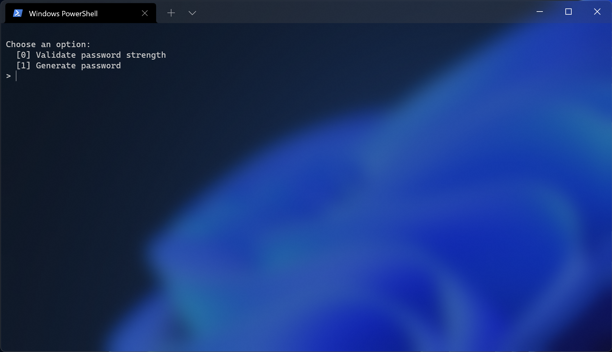
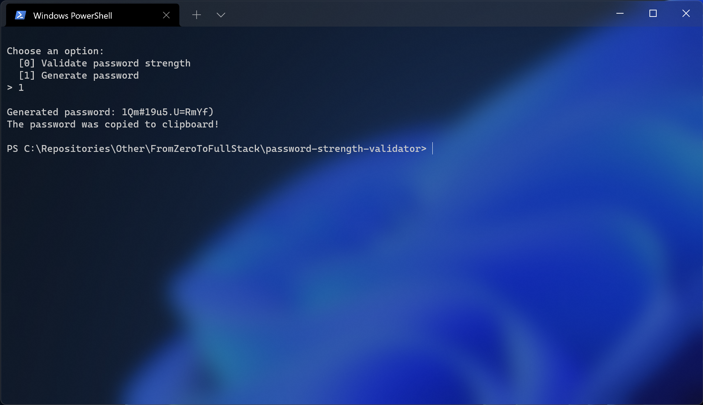
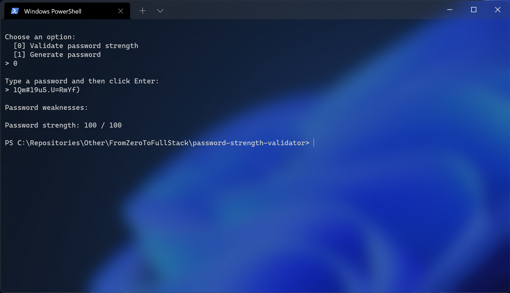

# Project

From zero to FullStack - an unofficial course led by [Pedro Soares](https://github.com/pncsoares) with the aim of guiding and helping two friends to learn programming and become software developers.

# PasswordStrengthValidator

This repository aims to create a password strength validator that:
- Shows how secure is the typed password
- Generate a new strong password







🙈 No data is collected!

# Technologies
- [HTML](https://developer.mozilla.org/en-US/docs/Web/HTML)
- [CSS](https://developer.mozilla.org/en-US/docs/Web/CSS)
- [JavaScript](https://developer.mozilla.org/en-US/docs/Web/JavaScript)
- [Node](https://nodejs.org/en/docs/)

# External packages

### `import rl from 'readline';`

Synchronous Readline for interactively running to have a conversation with the user via terminal.

[Documentation 📄](https://nodejs.org/api/readline.html)

### `import clipboard from 'clipboardy';`

Package used to copy some text to the clipboard. As simple as that.

[Documentation 📄](https://github.com/sindresorhus/clipboardy)

# Setup

## Clone repository

Create and go to the directory where you want to place the repository

```bash
  cd my-directory
```

Clone the project

```bash
  git clone https://github.com/from-zero-to-fullstack/password-strength-validator.git
```

Go to the project directory

```bash
  cd password-strength-validator
```

# How to execute

1. Open the terminal
2. Execute `cd` to the project root directory
3. Execute the following command
```
  node src/Script.js
```
4. Follow the instructions

> HINT 💡: You can run the application once to generate a password and again to validate the generated password strenth

# License

MIT